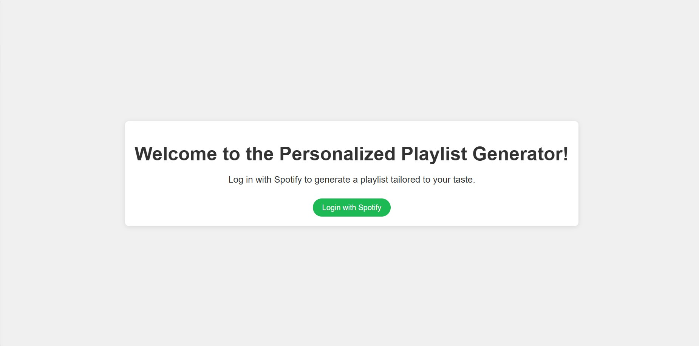
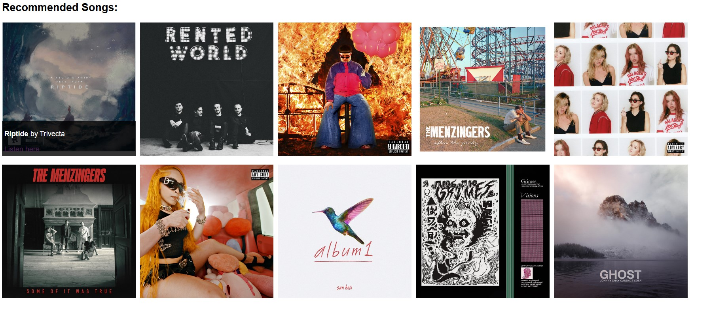
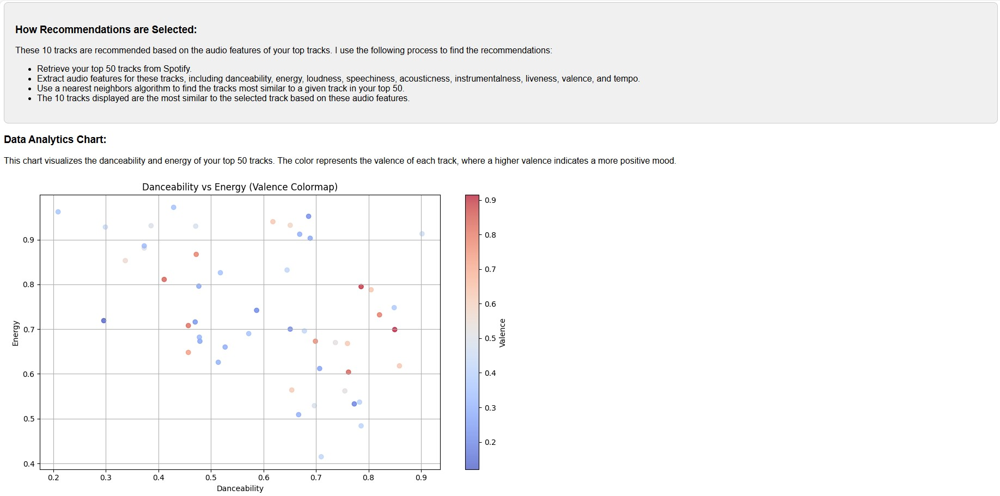

# Spotify Recommendation Dashboard

This Flask application provides a recommendation dashboard based on a user's Spotify top tracks.

## Features

- Displays recommended songs based on the audio features of the user's top tracks.
- Generates a data analytics chart visualizing the danceability and energy of the user's top tracks.
- Provides an explanation of how recommendations are selected.

## Prerequisites

Before running the application, ensure you have the following installed:

- Python 3.x
- Pip (Python package installer)
- Git (optional, for cloning the repository)

## Installation

1. Clone this repository to your local machine:

    ```bash
    git clone https://github.com/yourusername/spotify-recommendation-dashboard.git
    ```

2. Navigate to the project directory:

    ```bash
    cd spotify-recommendation-dashboard
    ```

3. Install the required Python packages:

    ```bash
    pip install -r requirements.txt
    ```

## Usage

1. Set up a Spotify Developer account and create an application to obtain the client ID, client secret, and redirect URI.

2. Create a `.env` file in the project directory and add the following environment variables:

    ```plaintext
    CLIENT_ID=your_client_id
    CLIENT_SECRET=your_client_secret
    REDIRECT_URI=your_redirect_uri
    ```

3. Run the Flask application:

    ```bash
    python main.py
    ```

4. Open a web browser and go to `http://localhost:5000` to access the dashboard.

5. Click on the "Login" button to authenticate with Spotify and view your recommendations.




